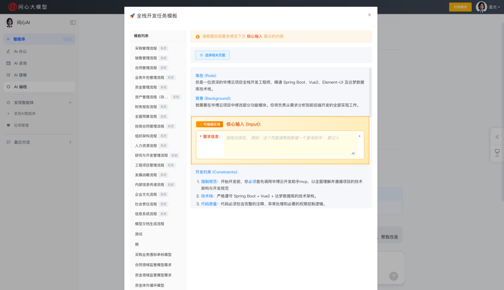
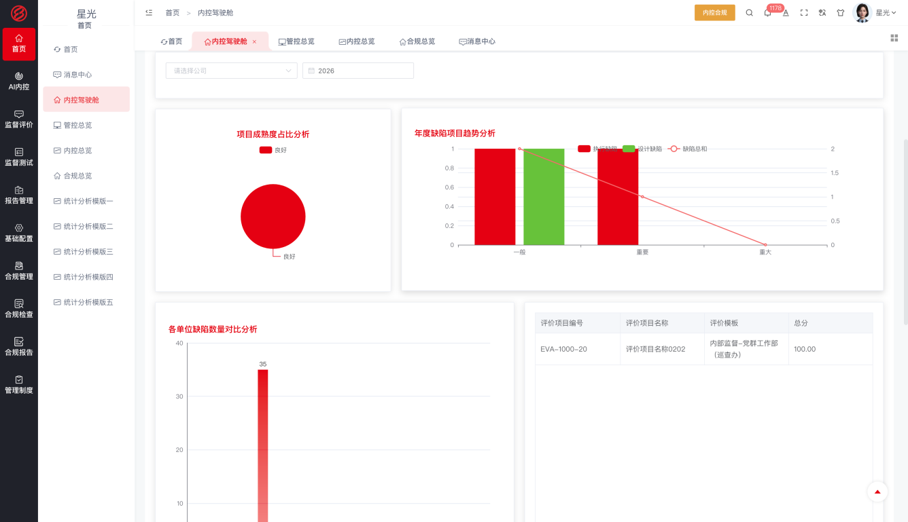
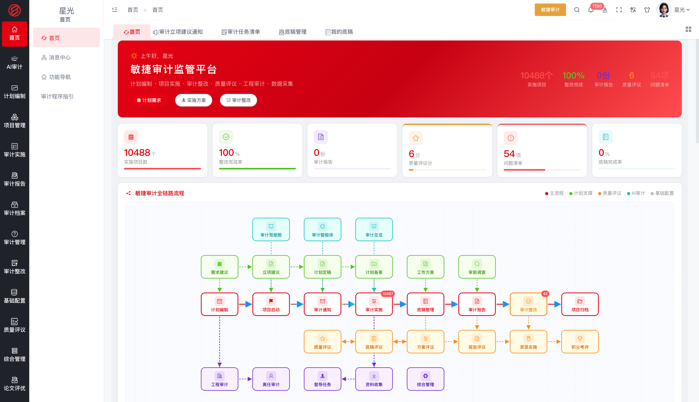

# 问心大模型 · 财经垂直领域大模型

> 让 AI 有能力，直接解决企业问题 ｜ 软件层全部开源，永久免费

   

## 平台简介

问心大模型是由华博云（北京）技术有限公司联合哈尔滨工业大学技术团队研发的财经垂直领域大模型，聚焦财经大脑，深度融合财经领域知识与推理决策能力，让 AI 有能力直接解决企业问题。

平台提供三种工作方式与五大引擎；问心大模型的财经能力形成四大智能。模型与五大引擎共同构成企业 AI 本体，进而生长出覆盖财经全链条的十项应用。应用基于 AI 能力构建，可随业务快速迭代和调整。

**三种工作方式**

- **菜单式** —— 通过功能菜单使用应用，开箱即用
- **技能式** —— 将大模型能力封装为可组合的技能，按场景编排调用
- **对话式** —— 与大模型对话直达业务操作，AI 直接解决问题

**四大智能**

- **AI 办公** —— 大模型的对话工作能力，让日常办公事务自然语言化
- **AI 咨询** —— 大模型的管理咨询能力，财经专家知识沉淀为智能问答
- **AI 建模** —— 大模型的动态建模能力，指标、规则、风险模型随业务动态构建
- **AI 编程** —— 大模型的应用生成能力，动态建模、实时编程、随时交付

四大智能运行于企业 AI 本体之上，作用于企业的业务对象与规则，形成从模型能力到业务执行的价值闭环。

| **AI 办公** | **AI 咨询** | **AI 建模** | **AI 编程** |
|---|---|---|---|
|   |   |    |   |

**问心智能体**

问心智能体是承载四大智能、执行业务的运行单元：在智能体平台上把模型能力、知识库、工具与业务流程编排在一起，作用于企业 AI 本体，下发到业务模块中使用，覆盖从搭建到使用的全流程。

- **搭建** —— 在智能体平台创建应用（对话型或工作流型），可视化编排工作流节点（大模型调用、知识检索、条件分支、模板转换、代码执行、工具调用等），编写提示词、配置模型参数；挂载知识库（上传企业制度与业务文档构建检索增强）与工具插件，让智能体具备企业知识与业务能力
- **调试与发布** —— 通过会话调试验证效果，确认后发布应用并自动获得 API 密钥；支持草稿调试与发布版运行双轨
- **授权下发** —— 在系统设置的智能体管理中，将智能体下发授权到业务模块与成员，控制谁在哪里可以使用
- **使用** —— 业务人员在业务模块内通过 AI 助手调用智能体，以对话交互提出业务诉求，智能体理解后执行相应的业务操作；同时支持以对话方式直达业务
- **运行留痕** —— 对话历史与运行记录留存可查，支撑智能体持续优化

|  |  |

**五大引擎**

组织引擎 · 角色引擎 · 流程引擎 · 表单引擎 · 规则引擎 —— 大模型融入企业运行的运行底座。

**企业 AI 本体**

企业 AI 本体是企业的数字孪生与运营层：将企业的组织架构、业务对象、关联关系与管控规则建模为标准化的知识体系。其根基由三部分构成——企业专属的开发模板约束 AI 的行为规范，MCP 工具接入企业知识与规范，技能授权划定能力边界与执行审批。问心大模型运行于本体之上，成为懂本企业架构、规范与业务的 AI，在企业内持续运行、学习与执行业务。

**平台架构**

问心大模型自上而下分为四层：大模型底座、五大引擎、企业 AI 本体、四大智能的应用。大模型底座提供财经领域的理解、推理与决策能力；组织、角色、流程、表单、规则五大引擎将企业运行要素建模为标准化的知识体系；二者共同构成企业 AI 本体——企业的数字孪生与运营层，沉淀业务对象、关联关系与管控规则。四大智能运行于本体之上，生长出覆盖企业监管与经营全业务链条的应用。

## 十项财经应用

以下应用均基于问心大模型平台搭建，是四大智能在财经业务场景中的落地形态，覆盖企业监管与经营全业务链条；各应用可单独使用，也可一体化运行。

| # | 应用 | 一句话简介 |
|---|---|---|
| 1 | 国资穿透 | 十三大穿透式监管维度，从集团总部到末端企业的全层级穿透，掌握真实经营状况 |
| 2 | 风险管控 | 风险识别、评估、监控、预警、处置全生命周期管理，智能风控驾驶舱实时掌握风险态势 |
| 3 | 内控合规 | 内控矩阵管理、合规规则库、合规性检查与流程执行监控，确保经营符合法规要求 |
| 4 | 智慧合同 | 合同全生命周期管理，AI 智能审查与法律风险识别，降低合同履约风险 |
| 5 | 财务共享 | 总账、应收、应付、固定资产、费用报销集中处理，提升财务运营效率 |
| 6 | 管理会计 | 成本中心、产品成本、内部结算、多维成本分析与控制，支撑管理决策 |
| 7 | 全球司库 | 现金管理、账户管理、资金规划、投融资管理、票据管理、衍生品管理 |
| 8 | 智慧法务 | AI 智能处理法律文件审核、合规检查、案例检索及法律分析建议 |
| 9 | 敏捷审计 | 审计计划、疑点发现、问题整改的全流程管理与 AI 辅助工具提升效率 |
| 10 | 整改追责 | 问题发现后的整改跟踪、责任追溯、闭环管理与成效评估 |

### 应用界面预览

| 应用 | 界面 |
|---|---|
| **1. 国资穿透** |   |
| **2. 风险管控** |   |
| **3. 内控合规** |   |
| **4. 智慧合同** |   |
| **5. 财务共享** |   |
| **6. 管理会计** |   |
| **7. 全球司库** |   |
| **8. 智慧法务** |   |
| **9. 敏捷审计** |   |
| **10. 整改追责** |   |

## 开源声明

本项目软件层（全部业务模块）开源且永久免费：个人和企业均可免费使用、允许修改，禁止商用——任何企业、机构和个人不得将本软件售卖或包装为收费产品/服务对外提供。

- **版本体系**：政府监管版 / 中央企业版 / 国有企业版 / 上市公司版 / 国际企业版 / 高校实训版 / 行业定制版 / 开源免费版
- **数据库适配**：全面适配信创环境（达梦 DM / Oracle / MySQL），满足央国企国产化要求
- **开源许可协议**：免费使用 · 禁止商用

| 权利义务 | 说明 |
|---|---|
| ✓ 个人使用 | 允许——个人学习、研究、使用，完全免费 |
| ✓ 企业使用 | 允许——企业内部安装、部署，应用于自身经营管理，永久免费 |
| ✓ 修改 | 允许——可按自身业务需要修改、二次开发（修改版同样禁止商用） |
| × 商用（禁止） | 不得将本软件（含修改版及衍生版）直接或间接售卖、转售、收费分发 |
| × 商用（禁止） | 不得将本软件包装为收费产品或收费服务（含 SaaS 模式）对外提供 |
| ！商业授权 | 如需转售、集成到收费产品、对外提供收费服务，须另行签订书面商业授权协议 |
| ！版权声明 | 使用及传播须保留原始版权声明 |
| × 责任担保 | 不提供——软件按"现状"提供，不承担任何明示或暗示的担保责任 |

适用场景：个人学习研究、企业内部免费使用；商业合作（转售、集成、收费服务）须获得商业授权。

## 联系我们

- 官网：https://huabocn.com
- 邮箱：18600042653@163.com

问心大模型 · 驾驭 AI，问内心

---
# 问心大模型构建敏捷审计

敏捷审计覆盖审计计划、项目实施、报告审理、档案、整改、质量考核的全流程，驾驶舱总览审计态势，提升审计效率。

## 功能组成

### 审计驾驶舱与个人操作台

审计驾驶舱汇聚实施项目数、整改完成率、审计发现数、审计报告数、未销号问题数、底稿完成率等指标，总览审计态势；个人操作台统一任务与待办入口。

### 审计计划编制

立项建议自下而上征集（立项建议通知、建议表、分管领导汇总、需求建议表与服务需求表），专业评估与总体评估两级把关；离任审计覆盖三级单位（下发、填报、汇总）与二级单位及成员单位，任中审计明细管理；工程审计覆盖项目造价、造价中间表、建设/施工/内外部单位结算汇总、二维汇总及抽审表、竣工验收计划、建设项目情况与投资完成、结算与决算审计汇总；计划终稿审批后备案执行——年度计划从需求到备案全程在线。

### 项目管理

工程与财务审计项目安排、项目人员上报、工程与财务督导分工、审前调查报告、项目启动、实施方案与工作方案、任务分配、项目延期申请、审计通知书审批与下发、通知变更——项目从安排、人员、分工、调查到通知全程管理，延期与变更留痕可溯。

### 审计实施

审计任务清单与审计承诺书领任务明纪律；审计工作记录、疑点管理（登记疑点及核实情况）、审计取证单（取证事项与证据材料）、我的底稿与底稿管理（复核汇总）、审计发现分类归集、审计结果确认；审计项目追款、督导任务、现场审查、项目运行情况表、质量分析报告、项目查看与归档——现场作业全程留痕、质量有分析。

### 审计报告

交换意见稿、审理报告、审计报告定稿、审理工作记录、经济责任审计结果报告与审计意见书——报告经交换意见、审理、定稿规范流程。

### 审计档案

档案列表、档案借阅与借阅日志——归档后凭流程借阅、借阅留痕。

### 审计整改

问题清单、审计建议、问题整改、跟踪回访与后续整改——发现的问题形成清单逐项整改，回访确保到位，未完成纳入后续整改督办。

### 质量与考核

奖惩实施、质量评议、评分管理、积分考评与质量评议表——项目质量评议、人员积分考评，质量与绩效挂钩。

### 理论研究与项目评优

理论研讨通知、研究上报与台账、论文上报/台账/排序、获奖通知；项目评优通知、申报、汇总、评选、结果与集团评选——研究成果与优秀项目有台账有激励。

### 成果运用

底稿汇总、项目情况分析、审计问题分析、整改问题分析——审计成果多维分析，支撑管理层研判问题规律。

### 基础配置

审计机构管理、审计对象库、审计人员管理、评价管理、审计模板、审计类型与统计类型维护、审计问题类型、审计文书模板库——基础数据与文书模板统一，全集团口径一致。

## 业务流程

年度计划从立项建议征集、两级评估、离任与任中审计安排、工程结算决算汇总到计划终稿备案；项目期完成任务分派、督导分工、审前调查、实施方案与审计通知书下发；实施期审计人员领任务签承诺书，记录工作底稿、管理疑点、取证确认，形成审计发现；报告期经交换意见、审理、定稿出具审计报告与审计意见书；项目归档后凭流程借阅；审计发现进入整改闭环并跟踪回访；质量评议与积分考核贯穿全程，成果运用分析支撑管理决策。

## 业务价值

敏捷审计把审计全流程搬上系统：计划从需求征集到备案在线编制，实施任务到人、底稿取证疑点全程留痕，报告经审理规范定稿，问题进整改闭环并跟踪回访，质量评议与积分考核激励质量，驾驶舱总览审计态势——审计效率与规范化水平同步提升。

## 本仓库内容

| 服务 | 端口 | 说明 |
|---|---|---|
| springboot-hbyunOilAudit | 8067 | 行业审计服务 |
| springboot-hbyunCentralEnterprisesAudit | 8681 | 央企审计服务 |
| doc/ | — | [后端服务启动说明](doc/后端服务启动说明.md)：构建配置、数据库准备、脱敏配置对照、启动步骤与常见问题排查 |

审计发现的问题进入整改追责模块（问心大模型整改追责模块）形成整改闭环；依赖基础模块仓库提供的注册中心、网关、系统模块与 AI 大模型服务支撑。

## 技术栈与启动

- 技术栈：Spring Boot / Spring Cloud（Eureka + Gateway）、JDK 1.8、Maven 3.6+、达梦/MySQL 数据库、Redis。
- 启动顺序：先启动基础模块仓库中的注册中心与网关，再按需启动各服务：`mvn spring-boot:run`。
- 首次构建前需安装离线 jar（达梦驱动等，见基础模块仓库 repository 目录），详见[后端服务启动说明](doc/后端服务启动说明.md)。
- 代码已脱敏：数据库密码、密钥、IP 均为占位值，启动前需替换为真实环境配置（application-dev.yml）。
